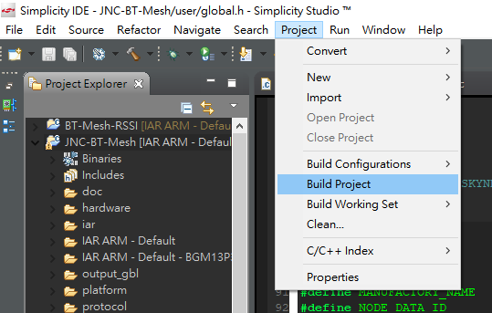
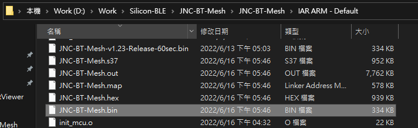
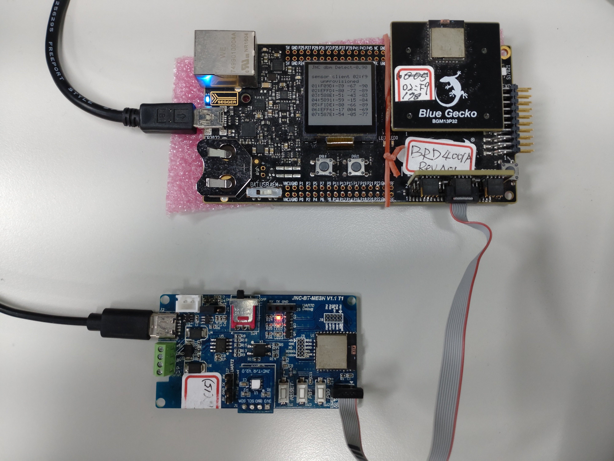
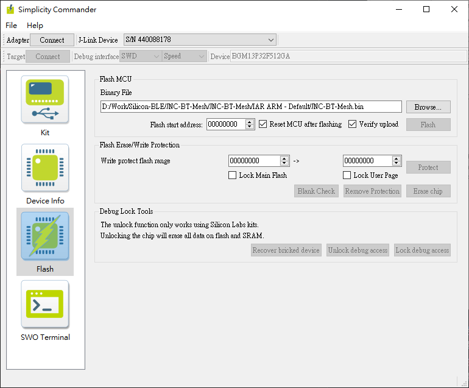

軟體工具
---
### IDE #
* IAR 8.3以上版本 
* <a href="http://192.168.0.30:88/download/02 技術部/02 開發產品/02 醫療系統/06-藍芽網路感測及接受系統 (Skynet)/08 程式碼燒錄/Silicon Tools/install-studio-v4_x64.exe"> Simplicity 4</a>

### 燒錄程式 #
* <a href="http://192.168.0.30:88/download/02 技術部/02 開發產品/02 醫療系統/06-藍芽網路感測及接受系統 (Skynet)/08 程式碼燒錄/Silicon Tools/commander.zip">commander</a>

### 專案匯出檔 #
* <a href="http://192.168.0.30:88/download/02 技術部/02 開發產品/02 醫療系統/06-藍芽網路感測及接受系統 (Skynet)/08 程式碼燒錄/Silicon Tools/JNC-BT-Mesh.sls">JNC-BT-Mesh.sls</a>

除了IAR之外，以上檔案都可以在檔管中找到：
* <a href="http://192.168.0.30:88/to?path=\02 技術部\02 開發產品\02 醫療系統\06-藍芽網路感測及接受系統 (Skynet)\08 程式碼燒錄\Silicon Tools">\02 技術部\02 開發產品\02 醫療系統\06-藍芽網路感測及接受系統 (Skynet)\08 程式碼燒錄\Silicon Tools</a>

開發準備
---
1. 安裝 Simplicity 4
2. 安裝 IAR
3. 下載 <a href="http://192.168.0.30:88/download/02 技術部/02 開發產品/02 醫療系統/06-藍芽網路感測及接受系統 (Skynet)/08 程式碼燒錄/Silicon Tools/JNC-BT-Mesh.sls">JNC-BT-Mesh.sls</a>
4. 匯入 JNC-BT-Mesh.sls
    - 啟動 Simplicity 4
    - 打開 File > Import
    - 按下Browse按鈕，選擇 JNC-BT-Mesh.sls 所在的資料夾
    - 隨著導引完成有專案匯入
5. 使用Git Pull 所需版本
6. 進行開發...

編譯
---
1. 在 Simplicity 4 選單中選擇 Project > Build Project

&emsp;&emsp;

2. bin檔會產生在專案資料夾中的 「IAR ARM - Default」資料夾中
&emsp;&emsp;

VSCode 一鍵編譯快捷鍵（選用）
---
除了在 Simplicity Studio 按 `Ctrl+B`，也可以在 VSCode 用快捷鍵編譯（背後執行的是同一個 `IAR ARM - Default/Makefile`）：

| 快捷鍵 | 功能 | 說明 |
| --- | --- | --- |
| `Ctrl + Shift + B` | 編譯 (make all) | 增量編譯，只重編改過的檔，**最快**。沒改檔會顯示 `Nothing to be done`。 |
| `Ctrl + Alt + B`   | 清除後重建 (make clean all) | 從零完整重編，會跑完整編譯過程並產生新的 `.bin`（約 1～3 分鐘）。 |

- 編譯過程顯示在 VSCode 下方**終端機**；錯誤/警告會列在 **「問題 (Problems)」面板**，可點擊跳到對應程式行。
- 也可從選單 **「終端機 Terminal」→「執行工作 Run Task」** 選擇要跑的編譯工作。
- ⚠️ 此功能需要兩個**本機設定檔**（不會隨 git 同步，每台電腦各設定一次）：
    - `.vscode/tasks.json`：定義上述兩個編譯工作（含 make 指令、IAR 8.3 與 msys 路徑）。
    - VSCode 使用者 `keybindings.json`：把 `Ctrl+Alt+B` 綁到「清除後重建」。
- 命令列建置指令與設定細節，請參閱專案根目錄的 `CLAUDE.md`「Build」章節。

燒錄
---
1. 安裝 <a href="http://192.168.0.30:88/download/02 技術部/02 開發產品/02 醫療系統/06-藍芽網路感測及接受系統 (Skynet)/08 程式碼燒錄/Silicon Tools/commander.zip">commander</a>
2. 接上燒錄器並連接 Skynet

&emsp;&emsp;</img>

3. 啟動 commander

&emsp;&emsp;</img>

4. 按下左上角 Adapter 右邊的 Connect按鈕 
    - 連結成功後按鈕會顯示為Disconnect
5. 按下左上角 Target 右邊的 Connect按鈕 
    - 連結成功後按鈕會顯示為Reconnect，右方的 Device 會顯示出「BGM13P32F512GA」
6. 選擇左邊的 Flash頁籤
7. 在Flash MCU欄位中，按下Browse，並選擇bin檔(JNC-BT-Mesh.bin)
8. 按下Flash按鈕進行燒錄

Debug 訊息（序列埠）
---
韌體會透過 **UART 把 debug 訊息送到電腦**，可用來觀察開機資訊、運作狀態、錯誤碼等。

- **訊號來源**：USART0 (VCOM)，**TX = PA0 / RX = PA1**
- **連線參數**：**115200 bps, 8N1**（鮑率固定）
- ⚠️ 注意：開機訊息裡顯示的 `baudrate:9600` 是 **RS485 / sensor 匯流排（USART2）** 的鮑率，**不是** debug 的鮑率。Debug 一律 **115200**。

**怎麼看 debug 訊息（三選一）：**
1. VSCode：`Ctrl+Shift+P` → `Run Task` → **「序列埠監看 (Serial Monitor COM6)」**（最方便）
2. PowerShell：`powershell -ExecutionPolicy Bypass -File scripts\serial_monitor.ps1 -Port COM6 -Baud 115200`
3. 任何序列埠終端機（PuTTY、Tera Term…）開啟對應 COM 埠，設 **115200 8N1**

> COM 埠號依您插入的 USB-UART 而定（本機驗證為 **COM6**）。可在「裝置管理員 → 連接埠 (COM 和 LPT)」查看。

更新記錄
---
請參閱 [CHANGELOG.MD](CHANGELOG.md)